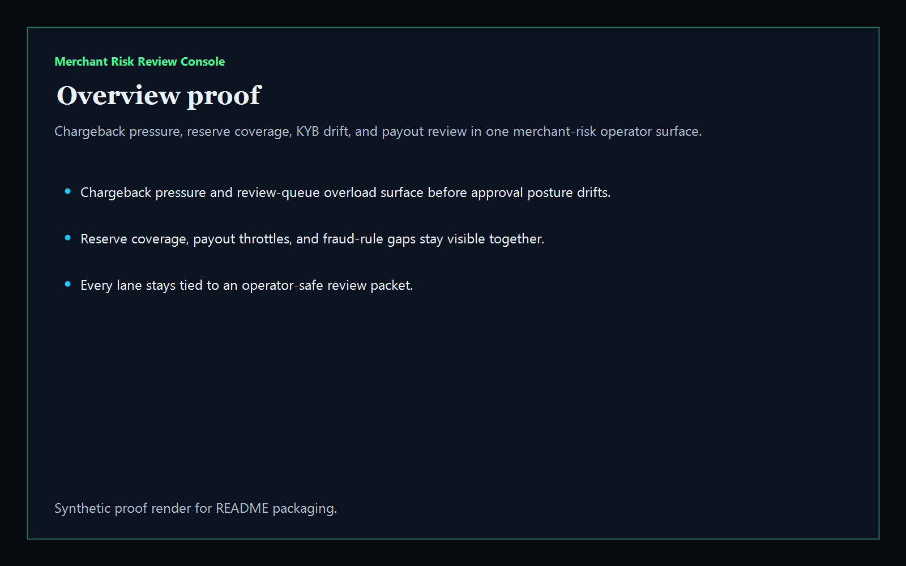
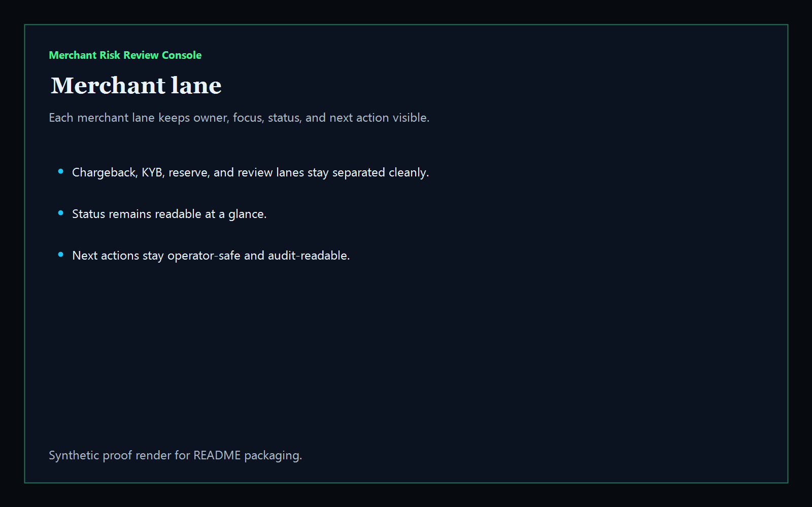
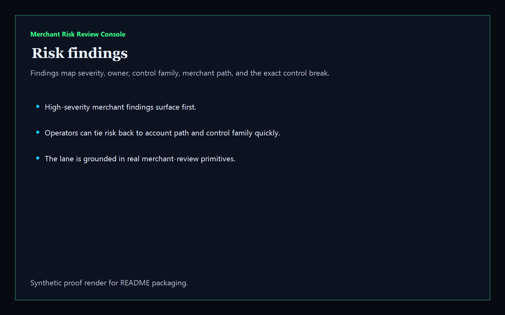
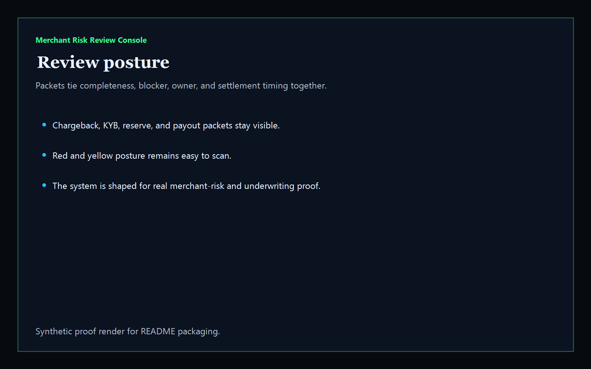

# Merchant Risk Review Console

[](https://github.com/mizcausevic-dev/merchant-risk-review-console/actions/workflows/ci.yml)
[](https://github.com/mizcausevic-dev/merchant-risk-review-console/actions/workflows/pages.yml)

Operator control plane for FinTech merchant review, chargeback pressure, reserve coverage, KYB drift, payout throttle risk, and manual-review posture.

## What it does

- merchant-lane visibility for chargeback, KYB, reserve, and review-queue operators
- offline-safe analysis of synthetic merchant-risk snapshot packets
- buyer-readable review posture for underwriting, payouts, fraud, and treasury stakeholders
- public synthetic control surface plus JSON APIs and CLI

## Product depth

Merchant Risk Review Console turns payment-risk fragments into a governed review packet. The surface is aimed at FinTech leaders who need to know which merchants are safe to approve, which accounts need evidence refresh, where reserves are under-covered, and which payout or fraud queues are starting to create operating exposure.

The product is intentionally readable by both business and technical reviewers:

- executives get a short exposure, savings, and investment view for board-ready merchant-risk decisions
- risk and underwriting teams get owners, control families, findings, blocker states, and next remediation moves
- platform reviewers get typed analysis code, JSON APIs, CLI output, synthetic fixtures, screenshots, and CI verification

## What these repos have in common

This repo follows the Kinetic Gain control-plane pattern used across the portfolio: a narrow operating problem becomes a public product surface with evidence, data contracts, verification routes, and deployment metadata. The goal is not a thin landing page. The goal is a reusable proof artifact that can support diligence, sales discovery, product marketing, and technical review.

Shared pattern:

- named operating lane with a buyer-readable problem statement
- synthetic sample data that proves the workflow without exposing credentials or customer records
- analyzer or service code that produces the same posture the public page displays
- README, screenshots, routes, APIs, CLI, and CI checks that make the repo inspectable
- footer and metadata links that connect the surface back to the broader Kinetic Gain estate

## Operating workflow

1. Ingest a merchant-risk snapshot with chargeback, KYB, reserve, payout, fraud-rule, and review-queue signals.
2. Normalize the snapshot into merchant lanes, findings, and review-posture packets.
3. Rank blockers by approval risk, settlement exposure, and remediation urgency.
4. Render the same evidence through CLI output, JSON APIs, static pages, README screenshots, and verification copy.
5. Keep the live surface offline-safe and synthetic so it can be reviewed publicly without leaking payment, processor, or customer data.

## Routes

- `/`
- `/merchant-lane`
- `/risk-findings`
- `/review-posture`
- `/verification`
- `/docs`

## API

- `/api/dashboard/summary`
- `/api/merchant-lane`
- `/api/risk-findings`
- `/api/review-posture`
- `/api/verification`
- `/api/sample`

## Screenshots






## CLI

```powershell
npx merchant-risk-review-console .\fixtures\merchant-risk.json --format markdown
```

## Local run

```powershell
cd merchant-risk-review-console
npm install
npm run verify
npm run prerender
npm run render:assets
npm run start
```

Then open:

- [http://127.0.0.1:5522/](http://127.0.0.1:5522/)
- [http://127.0.0.1:5522/merchant-lane](http://127.0.0.1:5522/merchant-lane)
- [http://127.0.0.1:5522/risk-findings](http://127.0.0.1:5522/risk-findings)
- [http://127.0.0.1:5522/review-posture](http://127.0.0.1:5522/review-posture)

## Live

- [https://merchant.kineticgain.com/](https://merchant.kineticgain.com/)

This repo publishes synthetic sample merchant-review data only. It does not ship live processor credentials, account secrets, or authenticated write paths.
